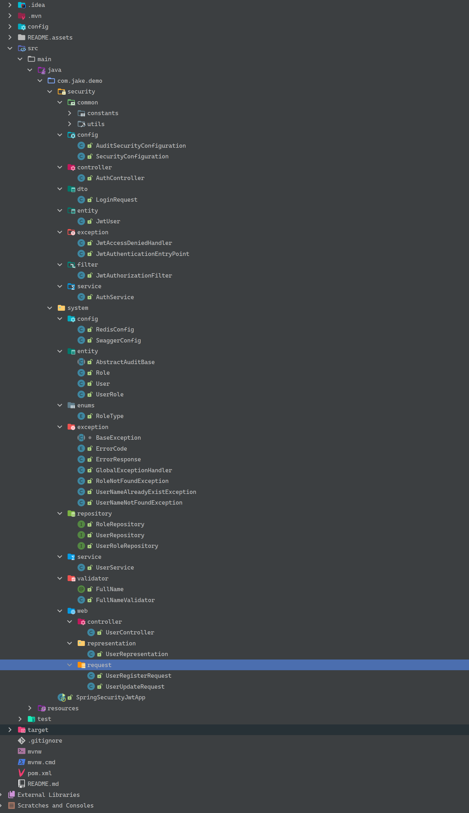
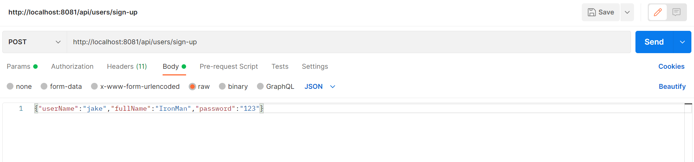
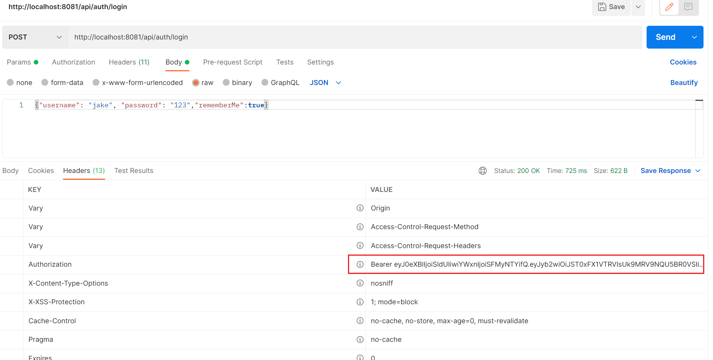
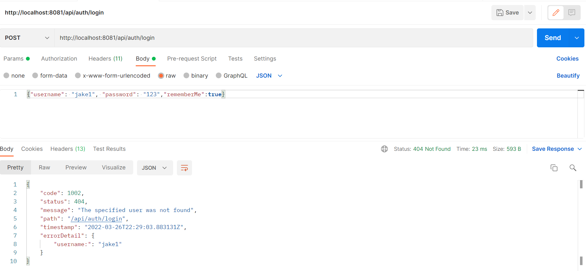
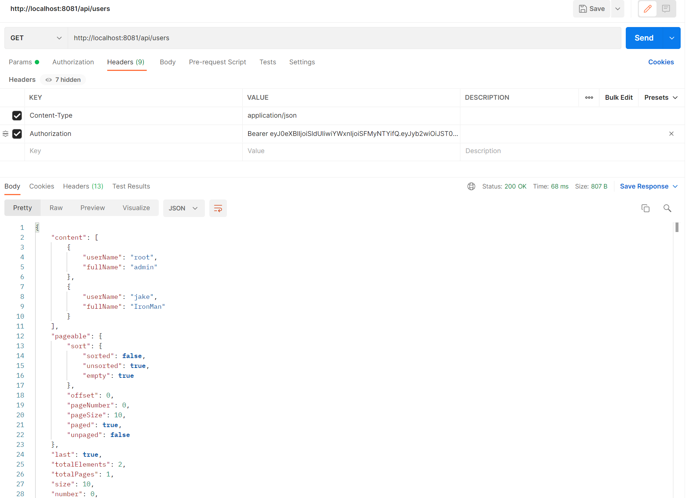
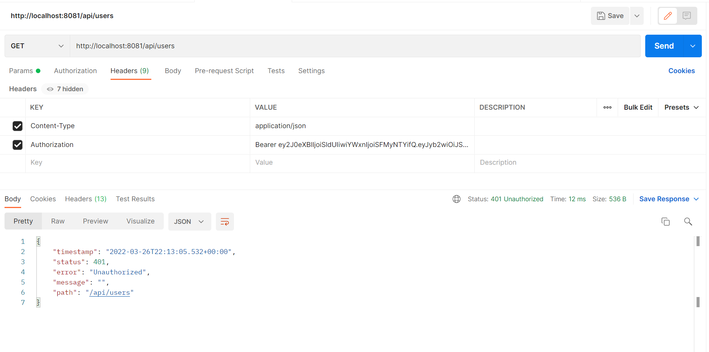
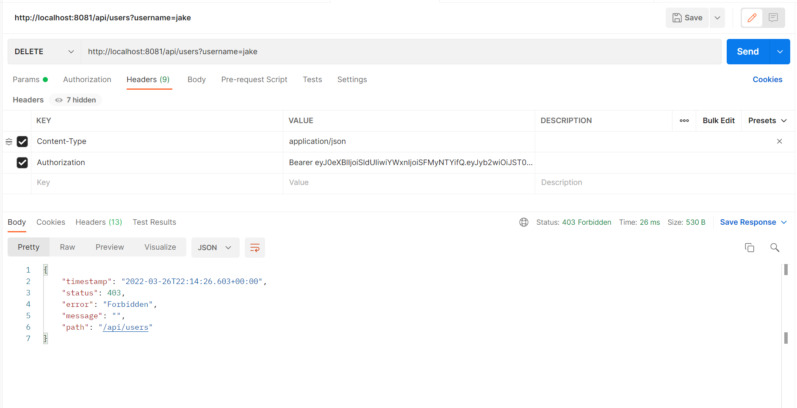

# Spring-security-jwt-demo


# Introduce

[Spring Security](https://spring.io/projects/spring-security) is a very powerful framework in the Spring family for authentication and permission control, and we can easily extend it to meet our current system security requirements.

This demo mainly uses **Spring Security** and **Spring Boot**, and all the dependencies adopt the latest stable version. Beyond the initial project, the JPA technology was also used.  


## Files Structure




## Tech

**Some frameworks/services used in the project:**

- **Database**: H2 in-memory database, no manual installation required.
- **Cache** : Redis
- **Permission framework**: Spring Security
- **ORM framework** : JPA (a small amount of SQL)
- **Interface documentation** : 
  - swagger. online API documentation at [http://localhost:8081/api/swagger-ui/](http://localhost:8081/api/swagger-ui/) . 
  - The swagger functionality is currently enhanced using knife4j at [http://localhost:8081/api/doc.html](http://localhost:8081/api/doc.html) 


## Features

- [x] Add H2 in-memory database support, no need for MySQL, just one click to start the project to access [http://localhost:8081/api/h2-console](http://localhost:8081/api/h2-console) (username:root,password:root)
- [x] Add Swagger, easy to call interface
- [x] Refactor the exception handling part of the code to optimize the return structure
- [x] Create a new role table, then associate users with roles by creating a new role_user table
- [x] File structure refactoring
- [x] add **Jpa** auditing functionality
- [x] login (login) interface exposed at controller level
- [x] Logout function: redis stores token information (key->user id,value->token) and removes the token information from redis after logout
- [x] Re-login will update the token information stored in redis

## 

## Setup

1. git clone this repo.
2. open project and wait maven to install project Dependencies
3. change `application.properties` change the database connection information parameter to your own
4. Run the project (related data tables will be created automatically, if you don't understand, take a look at JPA)


## Sample


### 1.Sign in 

**URL:** `POST http://localhost:8081/api/users/sign-up`

**RequestBody:**

```json
{"userName":"jake","fullName":"IronMan","password":"123"}
```

Newly registered users are bound by default to the following roles: USER and MANAGER.




### 2.Log in 

**URL:**`POST http://localhost:8081/api/auth/login`

**RequestBody:**

```json
{"username": "jake", "password": "123","rememberMe":true}
```

#### Success




#### Failed




### 3.Use the correct Token to access resources that require authentication

We use a GET request to access `/api/users`, the access rights for this interface are:

```java
@PreAuthorize("hasAnyRole('ROLE_USER','ROLE_MANAGER','ROLE_ADMIN')")
```




### 4.Access without a Token or with an invalid Token

We use GET requests to access `/api/users` but without a token or with an invalid token.



### 5.With the correct Token but with access rights

**URL:**`POST http://localhost:8081/api/users?username=jake`

We use a DELETE request to access `/api/users?username=xxx`, carrying a valid token, but the token does not have enough access rights.




